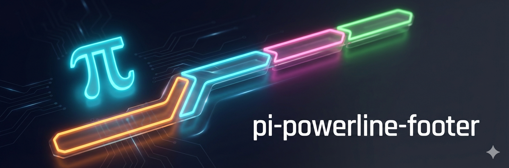

<p>
  
</p>

# pi-powerline-footer

Customizes the default [pi](https://github.com/badlogic/pi-mono) editor with a powerline-style status bar and AI-generated "vibes" for loading messages. Inspired by [Powerlevel10k](https://github.com/romkatv/powerlevel10k) and [oh-my-pi](https://github.com/can1357/oh-my-pi).


## Features

**Working Vibes** — AI-generated themed loading messages. Set `/vibe star trek` and your "Working..." becomes "Running diagnostics..." or "Engaging warp drive...". Supports any theme: pirate, zen, noir, cowboy, etc.

**Rounded box design** — Status renders directly in the editor's top border, not as a separate footer.

**Live thinking level indicator** — Shows current thinking level (`thinking:off`, `thinking:med`, etc.) with color-coded gradient. High and xhigh levels get a rainbow shimmer effect inspired by Claude Code's ultrathink.

**Smart defaults** — Nerd Font auto-detection for iTerm, WezTerm, Kitty, Ghostty, and Alacritty with ASCII fallbacks. Colors matched to oh-my-pi's dark theme.

**Git integration** — Async status fetching with 1s cache TTL. Automatically invalidates on file writes/edits. Shows branch, staged (+), unstaged (*), and untracked (?) counts.

**Context awareness** — Color-coded warnings at 70% (yellow) and 90% (red) context usage. Auto-compact indicator when enabled.

**Token intelligence** — Smart formatting (1.2k, 45M).

## Installation

```bash
pi install npm:pi-powerline-footer
```

Restart pi to activate.

## Usage

Activates automatically. Toggle with `/powerline`, switch presets with `/powerline <name>`.

| Preset | Description |
|--------|-------------|
| `default` | Model, thinking, path (basename), git, context, tokens |
| `minimal` | Just path (basename), git, context |
| `compact` | Model, git, context |
| `full` | Everything including hostname, time, abbreviated path |
| `nerd` | Maximum detail for Nerd Font users |
| `ascii` | Safe for any terminal |

**Environment:** `POWERLINE_NERD_FONTS=1` to force Nerd Fonts, `=0` for ASCII.

## Working Vibes

Transform boring "Working..." messages into themed phrases that match your style:

```
/vibe star trek    → "Running diagnostics...", "Engaging warp drive..."
/vibe pirate       → "Hoisting the sails...", "Charting course..."
/vibe zen          → "Breathing deeply...", "Finding balance..."
/vibe noir         → "Following the trail...", "Checking the angles..."
/vibe              → Shows current theme, mode, and model
/vibe off          → Disables (back to "Working...")
/vibe model        → Shows current model
/vibe model openai/gpt-4o-mini → Use a different model
/vibe mode         → Shows current mode (generate or file)
/vibe mode file    → Switch to file-based mode (instant, no API calls)
/vibe mode generate → Switch to on-demand generation (contextual)
/vibe generate mafia 200 → Pre-generate 200 vibes and save to file
```

### Configuration

In `~/.pi/agent/settings.json`:

```json
{
  "workingVibe": "star trek",                              // Theme phrase
  "workingVibeMode": "generate",                           // "generate" (on-demand) or "file" (pre-generated)
  "workingVibeModel": "anthropic/claude-haiku-4-5",        // Optional: model to use (default)
  "workingVibeFallback": "Working",                        // Optional: fallback message
  "workingVibeRefreshInterval": 30,                        // Optional: seconds between refreshes (default 30)
  "workingVibePrompt": "Generate a {theme} loading message for: {task}",  // Optional: custom prompt template
  "workingVibeMaxLength": 65                         // Optional: max message length (default 65)
}
```

### Modes

| Mode | Description | Pros | Cons |
|------|-------------|------|------|
| `generate` | On-demand AI generation (default) | Contextual, hints at actual task | ~$0.000015/msg, 500ms latency |
| `file` | Pull from pre-generated file | Instant, zero cost, works offline | Not contextual |

**File mode setup:**
```bash
/vibe generate mafia 200    # Generate 200 vibes, save to ~/.pi/agent/vibes/mafia.txt
/vibe mode file             # Switch to file mode
/vibe mafia                 # Now uses the file
```

**How file mode works:**
1. Vibes are loaded from `~/.pi/agent/vibes/{theme}.txt` into memory
2. Uses seeded shuffle (Mulberry32 PRNG) — cycles through all vibes before repeating
3. New seed each session — different order every time you restart pi
4. Zero latency, zero cost, works offline

**Prompt template variables (generate mode only):**
- `{theme}` — the current vibe theme (e.g., "star trek", "mafia")
- `{task}` — context hint (user prompt initially, then agent's response text or tool info on refresh)
- `{exclude}` — recent vibes to avoid (auto-populated, e.g., "Don't use: vibe1, vibe2...")

**How it works:**
1. When you send a message, shows "Channeling {theme}..." placeholder
2. AI generates a themed message in the background (3s timeout)
3. Message updates to the themed version (e.g., "Engaging warp drive...")
4. During long tasks, refreshes on tool calls (rate-limited, default 30s)
5. Cost: ~$0.000015 per generation (60 tokens @ haiku pricing)

## Thinking Level Display

The thinking segment shows live updates when you change thinking level:

| Level | Display | Color |
|-------|---------|-------|
| off | `thinking:off` | gray |
| minimal | `thinking:min` | purple-gray |
| low | `thinking:low` | blue |
| medium | `thinking:med` | teal |
| high | `thinking:high` | 🌈 rainbow |
| xhigh | `thinking:xhigh` | 🌈 rainbow |

## Path Display

The path segment supports three modes:

| Mode | Example | Description |
|------|---------|-------------|
| `basename` | `powerline-footer` | Just the directory name (default) |
| `abbreviated` | `…/extensions/powerline-footer` | Full path with home abbreviated and length limit |
| `full` | `~/.pi/agent/extensions/powerline-footer` | Complete path with home abbreviated |

Configure via preset options: `path: { mode: "full" }`

## Segments

`pi` · `model` · `thinking` · `path` · `git` · `subagents` · `token_in` · `token_out` · `token_total` · `codex` · `context_pct` · `context_total` · `time_spent` · `time` · `session` · `hostname` · `cache_read` · `cache_write`

## Separators

`powerline` · `powerline-thin` · `slash` · `pipe` · `dot` · `chevron` · `star` · `block` · `none` · `ascii`

## Theming

Colors are configurable via pi's theme system. Each preset defines its own color scheme, and you can override individual colors with a `theme.json` file in the extension directory.

### Default Colors

| Semantic | Theme Color | Description |
|----------|-------------|-------------|
| `pi` | `accent` | Pi icon |
| `model` | `primary` | Model name |
| `path` | `muted` | Directory path |
| `gitClean` | `success` | Git branch (clean) |
| `gitDirty` | `warning` | Git branch (dirty) |
| `thinking` | `muted` | Thinking level |
| `context` | `dim` | Context usage |
| `contextWarn` | `warning` | Context usage >70% |
| `contextError` | `error` | Context usage >90% |
| `tokens` | `muted` | Token counts |

### Custom Theme Override

Create `~/.pi/agent/extensions/powerline-footer/theme.json`:

```json
{
  "colors": {
    "pi": "#ff5500",
    "model": "accent",
    "path": "#00afaf",
    "gitClean": "success"
  }
}
```

Colors can be:
- **Theme color names**: `accent`, `primary`, `muted`, `dim`, `text`, `success`, `warning`, `error`, `borderMuted`
- **Hex colors**: `#ff5500`, `#d787af`

See `theme.example.json` for all available options.
